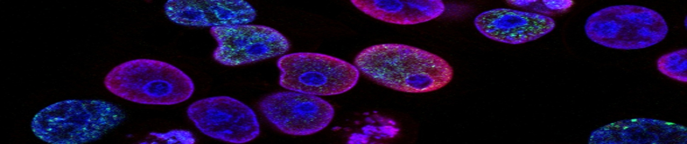
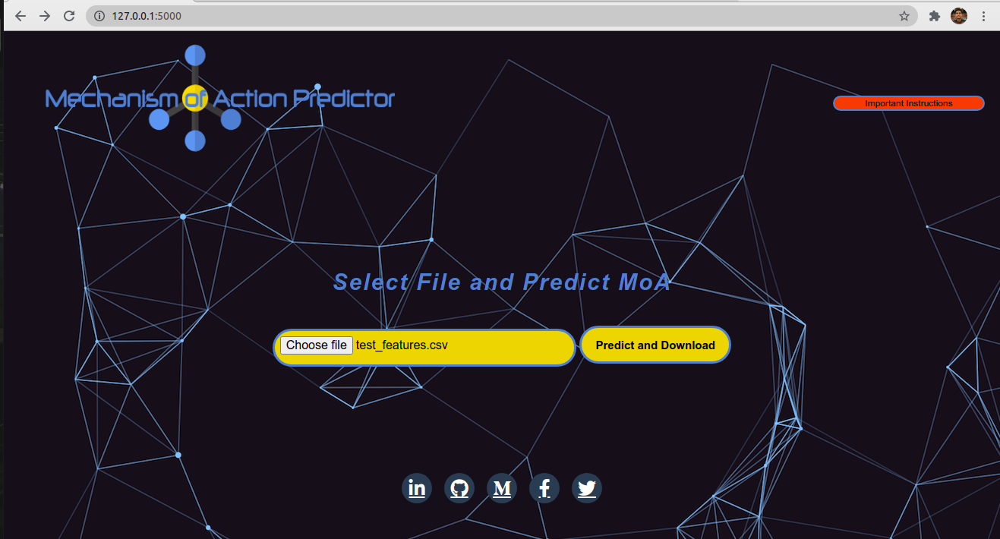

# Mechanism of Action Predictor - A multi-label machine learning classification case study

## Introduction and Overview

Mechanism of Action (MoA) is a label given to a molecule to describe its biological activity after treating it with a drug. In the past, scientists derived drugs from natural products or were inspired by traditional remedies.Today, with the advent of more powerful technologies, drug discovery has changed from the serendipitous approaches of the past to a more targeted model based on an understanding of the underlying biological mechanism of a disease.

## Dataset

Link to dataset : https://www.kaggle.com/c/lish-moa/data 
The dataset is consists of many csv files as:

* train_features.csv - Features for the training set.
* train_drug.csv - This file contains an anonymous drug_id for the training set only.
* train_targets_scored.csv - The binary MoA targets that are scored.
* train_targets_nonscored.csv - Additional (optional) binary MoA responses for the training data. These are not predicted nor scored.
* test_features.csv - Features for the test data. You must predict the probability of each scored MoA for each row in the test data.

# The challenge

This is a multi label problem since there are 206 target features we have to predict. So, the main challenge here is to find the way to train model or models for these many target variables using machine learning algorithms which trains faster by giving the best accuracy.

# Project life-cycle

* Got the dataset from Kaggle
* Done Exploratory Data Analysis (EDA)
* There was nothing to clean in the dataset
* Feature Engineering
  * Encoded categorical features
  * Normalized numerical features
  * Generated features using auto-encoder
  * Combined newly generated features with original features
* Model creation
* Web-app creation

# Libraries used

* Pandas
* Numpy
* Matplotlib
* Seaborn
* Sklearn
* Pickle
* Tensorflow
* Flask

# Machine Learning used and tried

* Logistic Regression
* Naive Bayes Classifier
* Random Forest Classifier
* XGBoost
* SVM
* KNN
**Logistic Regression performed best**

# Screen-shot of webpage

# Language used

# IDE used

# Blog
For detailed information visit:
https://niksaurabh.medium.com/mechanism-of-action-moa-prediction-63ced9da471e

